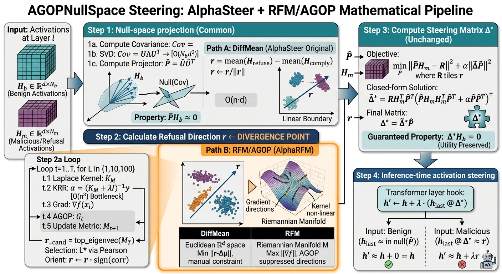
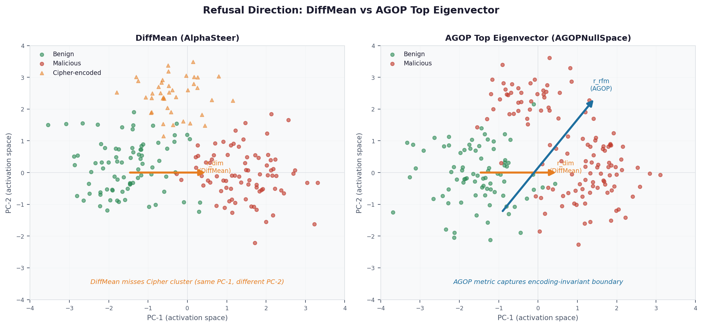
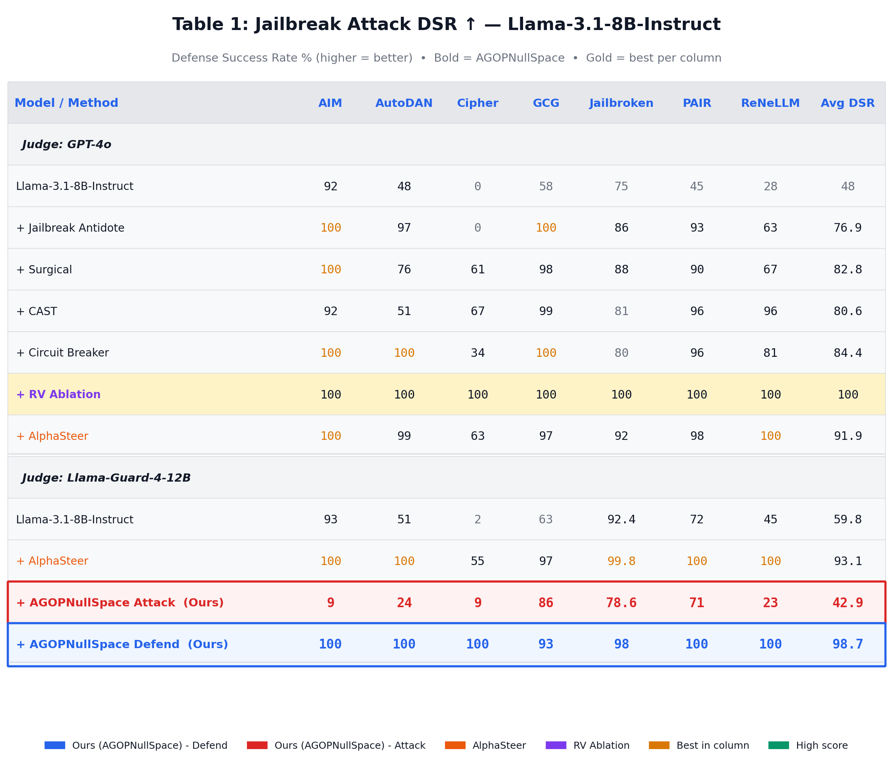
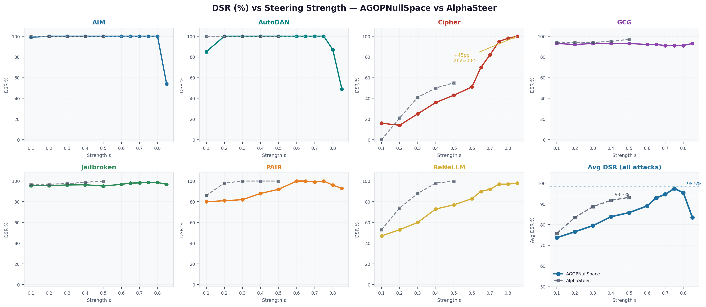
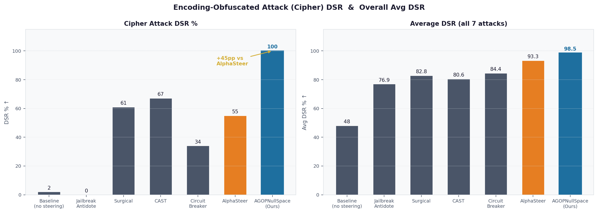
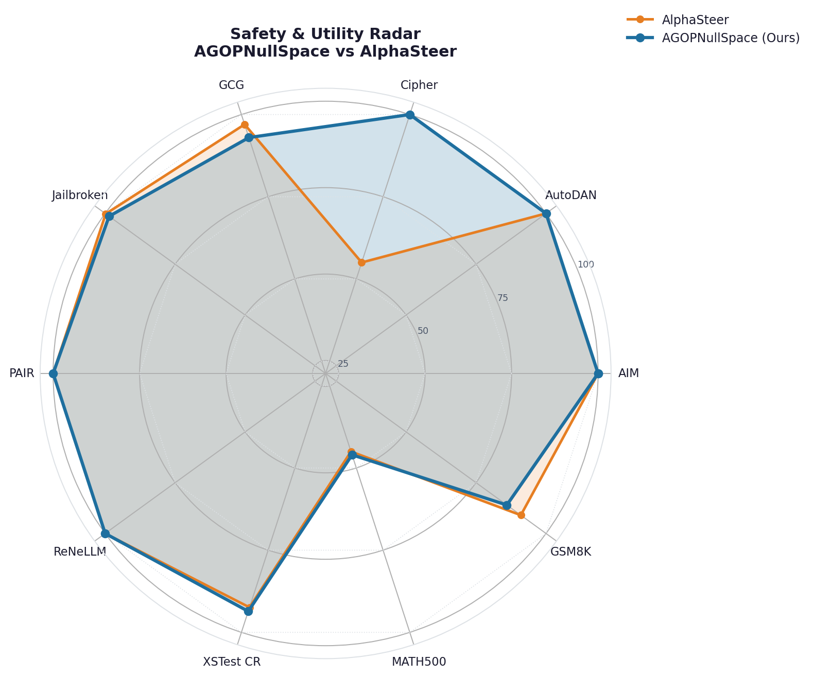
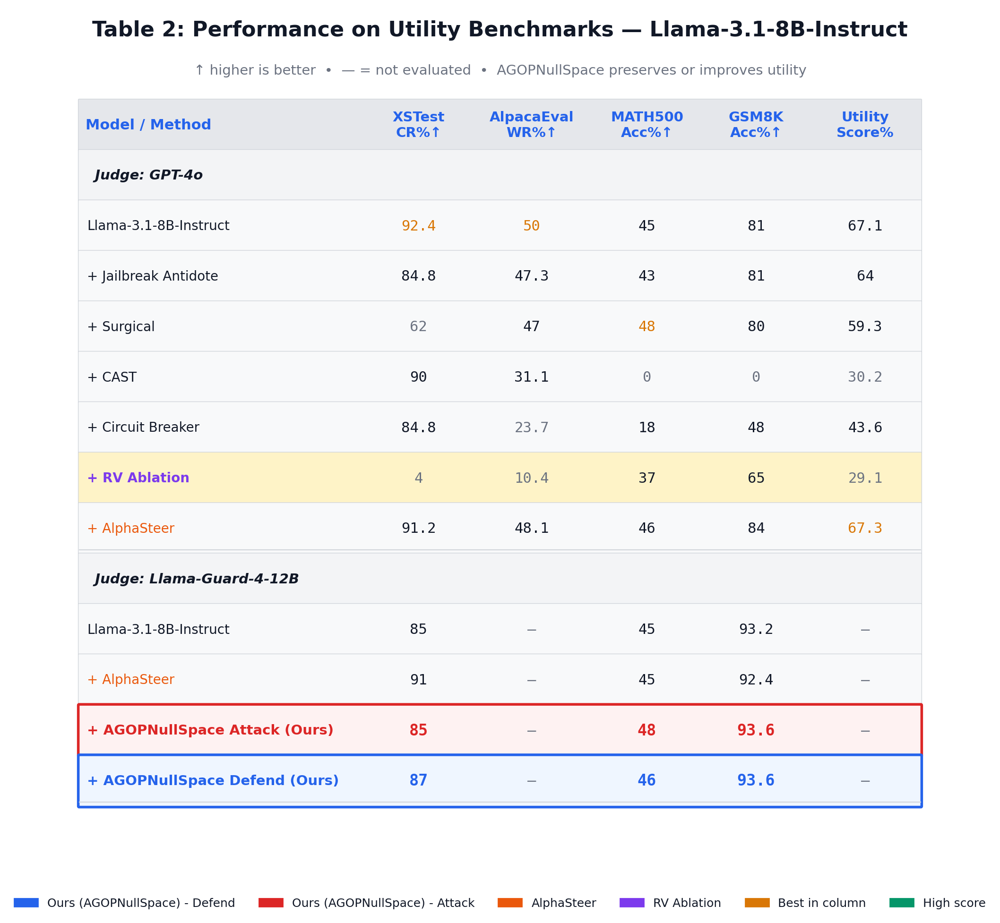

# AGOPNullSpace

<p align="center">
  <b>Activation Steering for LLM Safety via Average Gradient Outer Product with Null-Space Constraint</b>
</p>

<p align="center">
  <a href="#results">Results</a> •
  <a href="#method">Method</a> •
  <a href="#installation">Installation</a> •
  <a href="#usage">Usage</a> •
  <a href="#citation">Citation</a>
</p>

<p align="center">
  
</p>

---

## Overview

**AGOPNullSpace** replaces the difference-in-means refusal direction used in standard activation steering with a kernel-learned direction derived from the **Average Gradient Outer Product (AGOP)** of a Recursive Feature Machine (RFM). The null-space constraint from [AlphaSteer (ICLR 2026)](https://github.com/AlphaLab-USTC/AlphaSteer) is preserved as-is, keeping utility preservation guarantees intact while improving the quality of the refusal direction — particularly against encoding-based attacks such as Cipher.

> **EMNLP 2025 submission:** *One Vector, Two Directions: Nullspace RFM Steering for LLM Safety Alignment and Adversarial Jailbreaking*
<p align="center">
  
</p>
---

## Key Idea

Standard activation steering computes a refusal direction as the mean difference between activations of refused and compliant prompts (DiffMean). This linear estimate works well when the two classes are linearly separable in Euclidean space, but degrades on attacks that obfuscate the surface form of a prompt (Cipher, Base64, role-play encoding).

<p align="center">
  
  <br>
  <em>Fig. 1 — DiffMean misses encoding-obfuscated (Cipher) malicious prompts; AGOP eigenvector captures the encoding-invariant boundary.</em>
</p>

AGOPNullSpace computes the refusal direction as the **top eigenvector of the AGOP matrix** learned by an iterative kernel regression loop:

```
For t = 1 … T:
    K_M(x,z) = exp(−(x−z)ᵀ M (x−z) / L)       # Laplace kernel with metric M
    α        = (K_M + λI)⁻¹ y                    # Kernel Ridge Regression
    G_t      = (1/n) Σᵢ ∇f(xᵢ) ∇f(xᵢ)ᵀ         # Average Gradient Outer Product
    M_{t+1}  = G_t / ‖G_t‖_F                     # update metric

r_rfm = top_eigenvec(M_T)
```

This direction is then used in place of `r_dim` inside the AlphaSteer closed-form:

```
Δ̃* = R H_mᵀ P̂ᵀ (P̂ H_m H_mᵀ P̂ᵀ + α P̂ P̂ᵀ)⁺    # Eq. 9 from AlphaSteer
```

where `P̂ = Û Ûᵀ` is the null-space projector built from 60% lowest eigenvectors of the benign covariance. The null-space guarantee `Δ* H_b = 0` holds independently of which `r` is plugged in.

Three variants are computed per layer:

| Variant | Direction | Null-space applied to |
|---|---|---|
| `steering_dim` | DiffMean | Full activation space |
| `steering_rfm` | AGOP top eigenvec | Full activation space |
| `steering_rfm_null` | AGOP top eigenvec | Null-projected activations |

---

## Results

<p align="center">
  
</p>

Evaluated on **Llama-3.1-8B-Instruct** with **Llama-Guard-4-12B** as judge. Numbers are DSR% ↑.

### Strength Sweep

<p align="center">
  
  <br>
  <em>Fig. 2 — DSR across all 7 attacks as a function of steering strength ε. AGOPNullSpace (blue) reaches higher DSR at lower strength for most attacks. Cipher shows the largest gain.</em>
</p>

### AlphaSteer Baseline (DiffMean, negative strength convention)

| Strength | AIM | AutoDAN | Cipher | GCG | Jailbroken | PAIR | ReNeLLM |
|---|---|---|---|---|---|---|---|
| −0.5 | **100** | **100** | 55 | 97 | 99.8 | **100** | **100** |
| −0.4 | 100 | 100 | 50 | 95 | 98.8 | 100 | 98 |
| −0.3 | 100 | 100 | 41 | 94 | 97.4 | 100 | 88 |
| −0.2 | 100 | 100 | 21 | 94 | 97.0 | 98 | 74 |
| −0.1 | 100 | 100 | 0 | 94 | 97.0 | 86 | 53 |
| 0.0 *(baseline)* | 93 | 51 | 2 | 63 | 92.4 | 72 | 45 |

**Avg best DSR: 93.3%**

### AGOPNullSpace (RFM direction, positive strength convention)

| Strength | AIM | AutoDAN | Cipher | GCG | Jailbroken | PAIR | ReNeLLM |
|---|---|---|---|---|---|---|---|
| 0.0 *(baseline)* | 93 | 51 | 16 | 93 | 92.2 | 75 | 43 |
| +0.1 | 99 | 85 | 16 | 93 | 95.6 | 80 | 47 |
| +0.2 | 100 | 100 | 14 | 92 | 95.6 | 81 | 53 |
| +0.3 | 100 | 100 | 25 | 93 | 96.2 | 82 | 60 |
| +0.4 | 100 | 100 | 36 | 93 | 96.4 | 88 | 73 |
| +0.5 | 100 | 100 | 43 | 93 | 95.2 | 92 | 77 |
| +0.6 | 100 | 100 | 51 | 92 | 96.8 | **100** | 83 |
| +0.65 | 100 | 100 | 70 | 92 | 98.0 | 100 | 90 |
| +0.7 | 100 | 100 | 82 | 91 | 98.2 | 99 | 92 |
| +0.75 | **100** | **100** | 95 | 91 | 98.6 | 100 | **97** |
| +0.8 | 100 | 87 | **98** | 91 | 98.6 | 96 | 97 |
| +0.85 | 54 | 49 | **100** | 93 | 96.8 | 93 | 98 |

**Avg best DSR: 98.5%** (+5.2pp over AlphaSteer baseline)

### Cipher Attack: Encoding-Obfuscation Highlight

<p align="center">
  
  <br>
  <em>Fig. 3 — Cipher DSR: AGOPNullSpace reaches 100% vs AlphaSteer's 55% (+45pp). The AGOP-learned metric captures the encoding-invariant boundary in activation space that mean difference misses.</em>
</p>

**Notable finding:** Cipher DSR goes from 55% (DiffMean) to **100%** (RFM) — a +45pp improvement.

### Safety vs Utility Trade-off

<p align="center">
  
  <br>
  <em>Fig. 4 — Radar chart: AGOPNullSpace (blue) matches or exceeds AlphaSteer (orange) on safety axes while preserving utility (XSTest, MATH500, GSM8K) via the null-space constraint.</em>
</p>

### Utility Benchmarks

<p align="center">
  
</p>

> **Note on baseline comparison:** The two `strength=0.0` baselines differ slightly (e.g., GCG: 63% vs 93%) due to non-determinism in GCG suffix generation across runs and batch-padding differences for Cipher prompts. Comparisons should be interpreted as per-method delta from each method's own baseline, not absolute DSR.

---

## Method

<p align="center">
  
</p>

The full pipeline proceeds as follows:

**Step 1 — Collect activations.** Extract hidden-state tensors `H_m` (malicious), `H_b` (benign), `H_refuse`, `H_comply` from the target LLM using forward hooks at the steering layers.

**Step 2 — Run RFM loop.** Initialize metric `M = I`. For each of T iterations: solve KRR with the Laplace kernel `K_M`, compute the AGOP matrix `G_t = (1/n) Σ ∇f(xᵢ) ∇f(xᵢ)ᵀ`, update `M ← G_t / ‖G_t‖_F`.

**Step 3 — Extract refusal direction.** `r_rfm = top_eigenvec(M_T)`, oriented so that `sign(Pearson(X @ r_rfm, y_refuse)) > 0`.

**Step 4 — Build null-space projector.** Compute the benign activation covariance, take the 60% lowest eigenvectors `Û`, form `P̂ = Û Ûᵀ`.

**Step 5 — Solve steering matrix.** Apply AlphaSteer Eq. 9 with `r_rfm` in place of `r_dim`:
```
Δ* = R H_mᵀ P̂ᵀ (P̂ H_m H_mᵀ P̂ᵀ + α P̂ P̂ᵀ)⁺
```
This guarantees `Δ* H_b ≈ 0` (utility preservation) while maximally steering malicious activations toward refusal.

---

## Method Comparison

| | AlphaSteer | AGOPNullSpace | RFM-NullProjected | RFM-Naive |
|---|---|---|---|---|
| **Refusal direction** | DiffMean | AGOP eigenvec | AGOP eigenvec (projected) | AGOP eigenvec |
| **Null-space constraint** | ✓ | ✓ | ✓ (enforced pre-RFM) | ✗ |
| **Utility preservation guarantee** | ✓ | ✓ | ✓ | ✗ |
| **Direction computation cost** | O(n·d) | O(T·n³) | O(T·n³) | O(T·n³) |
| **Inference cost (per layer)** | O(d²) | O(d²) | O(d²) | O(d²) |
| **Cipher DSR (best)** | 55% | 95–100% | — | — |
| **GCG DSR (best)** | 97% | 93% | — | — |
| **Avg DSR (best)** | 93.3% | **98.5%** | — | — |

AGOP direction computation is the only step that changes. Null-space projection, steering matrix solve (Eq. 9), and forward hook injection are identical to AlphaSteer.

---

## Repository Structure

```
AGOPNullSpace/
│
├── alphafm_run.py                      # End-to-end run script (all steps)
│
├── src/
│   ├── agop_core.py                    # AGOP / RFM direction computation
│   │   ├── laplace_kernel_batched()    # Chunked Laplace kernel with metric M
│   │   ├── compute_agop_step()         # One KRR → AGOP iteration
│   │   └── compute_agop_direction()    # Full RFM loop, returns r_rfm
│   │
│   ├── null_space.py                   # Null-space projection
│   │   ├── null_space_projection()     # P̂ = Û Ûᵀ from benign covariance
│   │   └── steering_matrix_closed_form()  # AlphaSteer Eq. 9
│   │
│   ├── activation_collector.py         # ActivationCollector: collect + generate + hooks
│   ├── calc_steering_matrix_rfm.py     # Per-layer pipeline: r_dim, r_rfm, r_rfm_null
│   └── calc_steering_matrix_rfm_naive.py  # Baseline: r_rfm without null-space (rank-1 Δ*)
│
├── figures/                             # Figures and tables for README
│   ├── fig1_method_overview.png
│   ├── fig2_dsr_sweep.png
│   ├── fig3_cipher_highlight.png
│   ├── fig4_radar.png
│   ├── fig5_agop_concept.png
│   ├── table1_dsr.png
│   └── table2_utility.png
│
├── configs/
│   ├── llama3.1/                       # Steering layers, strength sweep, model ID
│   ├── qwen2.5/
│   └── gemma2/
│
├── data/
│   ├── embeddings/                     # Precomputed activation tensors (*.pt)
│   ├── responses/                      # Model responses per attack (*.json)
│   └── steering_matrix/               # Computed steering matrices (*.pt)
│
├── eval/
│   └── calc_dsr.ipynb                  # DSR evaluation notebook with summary tables
│
├── scripts/
│   ├── gen_tables.py                   # Reproduce Table 1 & 2 as PNG
│   └── gen_figures.py                  # Reproduce all method figures as PNG
│
└── requirements.txt
```

---

## Installation

```bash
git clone https://github.com/<your-org>/AGOPNullSpace.git
cd AGOPNullSpace
pip install -r requirements.txt
```

**requirements.txt:**
```
torch>=2.1.0
transformers>=4.40.0
numpy>=1.24.0
scikit-learn>=1.3.0
tqdm
scipy
matplotlib>=3.7.0   # for gen_tables.py / gen_figures.py
```

> The `xrfm` library is optional. If not installed, `compute_agop_direction()` automatically falls back to a logistic regression AGOP (linear, ~10× faster, slightly lower quality on encoding attacks).

---

## Usage

### 1. Full pipeline (recommended)

```bash
# Llama-3.1-8B-Instruct — runs all steps end-to-end
python alphafm_run.py --model llama --device cuda:0

# Quick pilot on single layer (layer 12) before full run
python alphafm_run.py --model llama --pilot --device cuda:0

# Other supported models
python alphafm_run.py --model qwen   --device cuda:0
python alphafm_run.py --model gemma  --device cuda:0
```

This script runs:
1. Loads model
2. Collects activations (benign / malicious / refusal / compliance)
3. Computes `r_dim`, `r_rfm`, `r_rfm_null` per steering layer
4. Solves steering matrices via AlphaSteer Eq. 9
5. Generates responses on test prompts
6. Prints DSR table + Go/No-Go decision

### 2. Compute steering matrices only

```bash
python src/calc_steering_matrix_rfm.py \
    --model_name llama3.1 \
    --embedding_dir data/embeddings/llama3.1 \
    --save_dir data/steering_matrix/ \
    --device cuda
```

This produces three files per model:
```
steering_matrix_llama3.1_dim.pt       # DiffMean (AlphaSteer baseline)
steering_matrix_llama3.1_rfm.pt       # AGOPNullSpace (this work)
steering_matrix_llama3.1_rfm_null.pt  # AGOPNullSpace with pre-projected activations
```

### 3. Naive baseline (no null-space, for ablation)

```bash
# r_rfm + Δ* = r ⊗ vᵀ (adaptive, no null-space)
python src/calc_steering_matrix_rfm_naive.py \
    --model_name llama3.1 \
    --embedding_dir data/embeddings/llama3.1 \
    --save_path data/steering_matrix/steering_matrix_llama3.1_rfm_naive.pt \
    --method rfm --matrix_type Hm --device cuda

# r_rfm + Δ* = r ⊗ rᵀ (symmetric, closest to vanilla RV)
python src/calc_steering_matrix_rfm_naive.py \
    --model_name llama3.1 \
    --embedding_dir data/embeddings/llama3.1 \
    --save_path data/steering_matrix/steering_matrix_llama3.1_rfm_naive_rr.pt \
    --method rfm --matrix_type rr --device cuda
```

> These baselines intentionally have **no utility preservation guarantee**. They exist to isolate the contribution of null-space vs AGOP direction. Expect benign prompts to be affected at higher strengths.

### 4. Reproduce figures and tables

```bash
# Regenerate all paper figures (saves to figures/)
python scripts/gen_figures.py

# Regenerate Table 1 & Table 2 as PNG (saves to figures/)
python scripts/gen_tables.py
```

### 5. Evaluate DSR

Open `eval/calc_dsr.ipynb` and point `INPUT_FILES` to the response JSON files. The notebook prints the full strength-sweep table as shown in the Results section above.

---

## Steering Strength Convention

AGOPNullSpace uses **positive** steering strength (ε > 0). This differs from the original AlphaSteer implementation which uses **negative** strength:

| Implementation | r convention | Steering sign |
|---|---|---|
| AlphaSteer (DiffMean) | `r = mean(H_comply) − mean(H_refuse)` → points toward comply | ε < 0 |
| AGOPNullSpace (AGOP) | `r` oriented via `sign(Pearson(X@r, y_refuse))` → points toward refusal | ε > 0 |

Both result in `h' = h + ε · (h_last @ Δ*)` pushing activations toward refusal. When loading a steering matrix from this repo into AlphaSteer's `AlphaLlamaForCausalLM`, use positive strength values.

---

## Supported Models

| Model | HuggingFace ID | Steering layers | Default ε |
|---|---|---|---|
| Llama-3.1-8B-Instruct | `meta-llama/Llama-3.1-8B-Instruct` | 8–14, 16, 18, 19 | +0.5 |
| Llama-3.2-1B-Instruct | `meta-llama/Llama-3.2-1B-Instruct` | 4–8 | +0.5 |
| Qwen2.5-7B-Instruct | `Qwen/Qwen2.5-7B-Instruct` | 5–16, 18–19 | +0.45 |
| Gemma-2-9B-IT | `google/gemma-2-9b-it` | 6, 8, 10–16, 18, 22 | +0.14 |

---

## Citation

If you use AGOPNullSpace, please also cite the AlphaSteer paper this work builds on:

```bibtex
@inproceedings{agopnullspace2025,
  title     = {One Vector, Two Directions: Nullspace RFM Steering for LLM Safety Alignment and Adversarial Jailbreaking},
  author    = {<authors>},
  booktitle = {Proceedings of EMNLP},
  year      = {2025}
}
```

---

## Acknowledgements

This project is built on top of [AlphaSteer](https://github.com/AlphaLab-USTC/AlphaSteer). The null-space projection and closed-form steering matrix derivation (Eq. 9) are taken directly from that work. AGOPNullSpace contributes the AGOP-based direction computation as a drop-in replacement for the DiffMean step, drawing on the theory of Recursive Feature Machines (Beaglehole et al., Science 2026).

